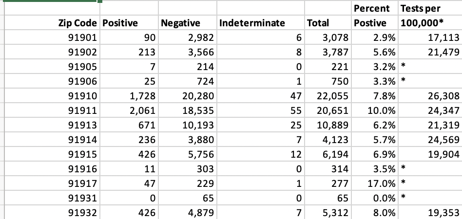

This notebook attempts to aggregate Riverside County, CA testing counts in a format that will work well the aggregations provided by San Diego Count, CA.



It's likely that we'll change the data shape of the above data as well. For instance, it is not tidy to have separate columns for the test result. There should be one column with the value of that result.

Here is what we will aim for with each data set:

- date_week_end
- zip
- test_result
- count

(I'm not sure if the "name" -- which I have renamed "place" -- will come into play here.)

But this Riverside County data is individual tests. We need to aggregate them by week. The notebook `02-time-study.Rmd` figures out how to do this and we apply that result here.

```{r setup, echo=T, results='hide', message=F, warning=F}
library(tidyverse)
library(lubridate)
```


## Import

This data comes from the result of `01-clean.Rmd`.

```{r import}
riverside <- read_rds("data-processed/riverside.rds")

riverside %>% glimpse()
```

## Create our zipcode aggregations

```{r}
weekly_cnt <- riverside %>% 
  count(
    week = ceiling_date(lab_date, "week") - 1,
    zipcode,
    lab_result
  ) %>% 
  rename(
    tests = n
  )

weekly_cnt %>% glimpse()
```

## Reshape by test results

```{r}
weekly_results <- weekly_cnt %>% 
  pivot_wider(
    names_from = lab_result,
    values_from = tests
  ) %>% 
  arrange(week, zipcode)

## peek at results
weekly_results
```

## Quick eyeball test of aggregation

Looking at first date in raw data to compare to the top of the table above.

```{r}
riverside %>% 
  filter(
    lab_date == "2020-01-04"
  ) %>% 
  arrange(zipcode)
```

## Export the file

```{r export}
weekly_results %>%
  write_csv("data-processed/riverside_weekly_results.csv")
```

